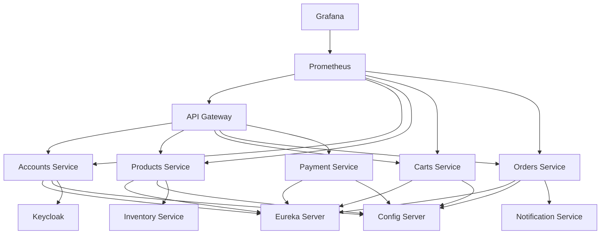
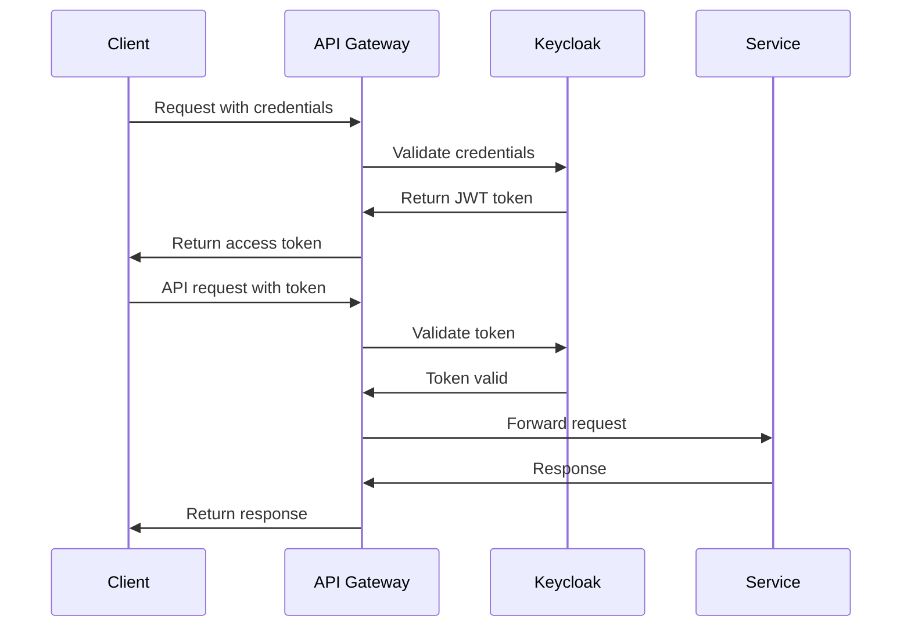

# Oralie - E-commerce Microservices Platform

[](https://jenkins.io/) 
[](https://sonarcloud.io/) 
[](https://github.com/vietviet08/Oralie/releases) 
[](LICENSE)
[](https://www.oracle.com/java/)
[](https://spring.io/projects/spring-boot)

> A modern, scalable e-commerce platform built with microservices architecture, featuring comprehensive product management, shopping cart, order processing, payment integration, and advanced DevOps monitoring capabilities.

---

## Table of Contents
- [Description](#description)
- [Features](#features)
- [Architecture](#architecture)
- [Screenshots](#screenshots)
- [Installation & Setup](#installation--setup)
- [Usage](#usage)
- [Configuration](#configuration)
- [Project Structure](#project-structure)
- [API Documentation](#api-documentation)
- [Testing](#testing)
- [Deployment](#deployment)
- [Contributing](#contributing)
- [License](#license)
- [Authors & Maintainers](#authors--maintainers)
- [Acknowledgments](#acknowledgments)

---

## Description

Oralie is a comprehensive e-commerce platform designed with modern microservices architecture. The platform provides a complete online shopping experience with features including product catalog management, shopping cart functionality, order processing, payment integration, user authentication, and real-time notifications.

Built with Spring Boot and Spring Cloud ecosystem, Oralie emphasizes scalability, maintainability, and observability. The platform integrates industry-standard DevOps practices including containerization, service discovery, API gateway, centralized configuration, monitoring, and logging.

**Key Objectives:**
- Provide a scalable and maintainable e-commerce solution
- Demonstrate microservices best practices
- Integrate modern DevOps and monitoring tools
- Support high availability and fault tolerance
- Enable easy deployment and scaling

## Features

### 🛍️ Core E-commerce Features
- **Product Management**: Complete product catalog with categories, pricing, and inventory
- **Shopping Cart**: Add, remove, and manage items with real-time updates
- **Order Processing**: End-to-end order management from creation to fulfillment
- **Payment Integration**: Secure payment processing and transaction management
- **User Authentication**: Comprehensive user registration, login, and profile management
- **Search & Filter**: Advanced product search and filtering capabilities

### 🏗️ Technical Features
- **Microservices Architecture**: Loosely coupled services for better scalability
- **Service Discovery**: Automatic service registration and discovery with Eureka
- **API Gateway**: Centralized routing and load balancing
- **Configuration Management**: Centralized configuration with Spring Cloud Config
- **Authentication & Authorization**: OAuth2/JWT with Keycloak integration
- **Real-time Notifications**: Event-driven notification system

### 📊 Monitoring & Observability
- **Metrics Collection**: Prometheus for metrics aggregation
- **Visualization**: Grafana dashboards for monitoring
- **Distributed Tracing**: Request tracing across microservices
- **Centralized Logging**: Log aggregation with Loki
- **Health Checks**: Application and infrastructure health monitoring

### 🚀 Planned Features
- **Recommendation Engine**: AI-powered product recommendations
- **Product Reviews & Ratings**: Customer feedback system
- **Live Chat Support**: Real-time customer support
- **Mobile App**: Native mobile applications
- **Multi-tenant Support**: Support for multiple vendors
- **Advanced Analytics**: Business intelligence and reporting

## Architecture


The platform follows a microservices architecture pattern with the following key components:

- **API Gateway**: Single entry point for all client requests
- **Service Registry**: Eureka server for service discovery
- **Config Server**: Centralized configuration management
- **Authentication**: Keycloak for identity and access management
- **Business Services**: Independent microservices for different domains
- **Monitoring Stack**: Prometheus, Grafana, and Loki for observability
## Screenshots

### 🖥️ Infrastructure & Monitoring
<table>
  <tr>
    <td align="center">
      
      <br><strong>Docker Containers</strong>
    </td>
    <td align="center">
      
      <br><strong>Service Discovery (Eureka)</strong>
    </td>
  </tr>
  <tr>
    <td align="center">
      
      <br><strong>Metrics (Prometheus)</strong>
    </td>
    <td align="center">
      
      <br><strong>Monitoring (Grafana)</strong>
    </td>
  </tr>
  <tr>
    <td align="center">
      
      <br><strong>Authentication (Keycloak)</strong>
    </td>
    <td align="center">
      
      <br><strong>Distributed Logging (Loki)</strong>
    </td>
  </tr>
</table>

### 🛒 User Interface
<table>
  <tr>
    <td align="center">
      
      <br><strong>Home Page</strong>
    </td>
    <td align="center">
      
      <br><strong>User Login</strong>
    </td>
  </tr>
  <tr>
    <td align="center">
      
      <br><strong>Product Catalog</strong>
    </td>
    <td align="center">
      
      <br><strong>Product Details</strong>
    </td>
  </tr>
  <tr>
    <td align="center">
      
      <br><strong>Shopping Cart</strong>
    </td>
    <td align="center">
      
      <br><strong>Checkout Process</strong>
    </td>
  </tr>
</table>

### 🏪 Admin Interface
<table>
  <tr>
    <td align="center">
      
      <br><strong>Admin Dashboard</strong>
    </td>
    <td align="center">
      
      <br><strong>Product Management</strong>
    </td>
  </tr>
  <tr>
    <td align="center">
      
      <br><strong>Add New Product</strong>
    </td>
    <td align="center"></td>
  </tr>
</table>

---

## Installation & Setup

### Prerequisites

Ensure you have the following installed on your system:

| Tool | Version | Purpose |
|------|---------|---------|
| Java JDK | 17+ | Runtime environment |
| Maven | 3.8+ | Build automation |
| Docker | 20.10+ | Containerization |
| Docker Compose | 2.0+ | Multi-container deployment |
| Git | 2.30+ | Version control |

### Quick Start

1. **Clone the repository**
   ```bash
   git clone https://github.com/vietviet08/Oralie.git
   cd Oralie
   ```

2. **Build the project**
   ```bash
   # Build all microservices
   ./mvnw clean install
   
   # Or build individual services
   cd accounts && ../mvnw clean install
   cd ../products && ../mvnw clean install
   # ... repeat for other services
   ```

3. **Run with Docker Compose (Recommended)**
   ```bash
   # Start all services
   docker-compose up -d
   
   # Check service status
   docker-compose ps
   
   # View logs
   docker-compose logs -f [service-name]
   ```

4. **Run locally (Development)**
   ```bash
   # Start infrastructure services first
   docker-compose up -d keycloak eureka-server config-server
   
   # Then start business services
   cd accounts && ../mvnw spring-boot:run &
   cd ../products && ../mvnw spring-boot:run &
   cd ../carts && ../mvnw spring-boot:run &
   # ... start other services as needed
   ```

### Environment Setup

1. **Create environment file**
   ```bash
   cp .env.example .env
   ```

2. **Configure environment variables**
   ```env
   # Database Configuration
   DB_HOST=localhost
   DB_PORT=3306
   DB_NAME=oralie
   DB_USERNAME=oralie_user
   DB_PASSWORD=oralie_pass
   
   # Keycloak Configuration
   KEYCLOAK_URL=http://localhost:8080
   KEYCLOAK_REALM=oralie
   KEYCLOAK_CLIENT_ID=oralie-client
   
   # Service Discovery
   EUREKA_SERVER_URL=http://localhost:8761/eureka
   
   # Monitoring
   PROMETHEUS_URL=http://localhost:9090
   GRAFANA_URL=http://localhost:3000
   ```

### Verification

After successful setup, verify the installation:

1. **Service Registry**: http://localhost:8761
2. **API Gateway**: http://localhost:8080
3. **Keycloak Admin**: http://localhost:8080/auth/admin
4. **Grafana Dashboard**: http://localhost:3000
5. **Prometheus**: http://localhost:9090

---

## Usage

### Accessing the Application

| Service | URL | Description |
|---------|-----|-------------|
| Main Application | http://localhost:8080 | Customer-facing e-commerce site |
| Admin Panel | http://localhost:8080/admin | Administrative interface |
| API Gateway | http://localhost:8080/api | REST API endpoints |
| Service Registry | http://localhost:8761 | Eureka dashboard |
| Monitoring | http://localhost:3000 | Grafana dashboards |

### API Examples

#### Authentication
```bash
# Login
curl -X POST http://localhost:8080/api/auth/login \
  -H "Content-Type: application/json" \
  -d '{"username": "user@example.com", "password": "password"}'

# Get user profile
curl -X GET http://localhost:8080/api/auth/profile \
  -H "Authorization: Bearer YOUR_JWT_TOKEN"
```

#### Product Management
```bash
# Get all products
curl -X GET http://localhost:8080/api/products

# Get product by ID
curl -X GET http://localhost:8080/api/products/1

# Search products
curl -X GET "http://localhost:8080/api/products/search?q=laptop&category=electronics"

# Create product (admin only)
curl -X POST http://localhost:8080/api/products \
  -H "Content-Type: application/json" \
  -H "Authorization: Bearer ADMIN_TOKEN" \
  -d '{
    "name": "Gaming Laptop",
    "description": "High-performance gaming laptop",
    "price": 1299.99,
    "categoryId": 1,
    "stock": 50
  }'
```

#### Shopping Cart
```bash
# Add item to cart
curl -X POST http://localhost:8080/api/carts/items \
  -H "Content-Type: application/json" \
  -H "Authorization: Bearer USER_TOKEN" \
  -d '{"productId": 1, "quantity": 2}'

# Get cart contents
curl -X GET http://localhost:8080/api/carts \
  -H "Authorization: Bearer USER_TOKEN"

# Update item quantity
curl -X PUT http://localhost:8080/api/carts/items/1 \
  -H "Content-Type: application/json" \
  -H "Authorization: Bearer USER_TOKEN" \
  -d '{"quantity": 3}'
```

#### Order Processing
```bash
# Create order
curl -X POST http://localhost:8080/api/orders \
  -H "Content-Type: application/json" \
  -H "Authorization: Bearer USER_TOKEN" \
  -d '{
    "shippingAddress": {
      "street": "123 Main St",
      "city": "Anytown",
      "zipCode": "12345",
      "country": "USA"
    },
    "paymentMethod": "CREDIT_CARD"
  }'

# Get order history
curl -X GET http://localhost:8080/api/orders \
  -H "Authorization: Bearer USER_TOKEN"

# Get order details
curl -X GET http://localhost:8080/api/orders/1 \
  -H "Authorization: Bearer USER_TOKEN"
```

### Default Credentials

| Role | Username | Password | Description |
|------|----------|----------|-------------|
| Admin | admin@oralie.com | admin123 | Full system access |
| Manager | manager@oralie.com | manager123 | Product and order management |
| Customer | user@oralie.com | user123 | Regular customer account |

---

## Configuration

### Application Configuration

Each microservice has its own configuration file located in `src/main/resources/application.yml`:

```yaml
# Example configuration for products service
server:
  port: 8081

spring:
  application:
    name: products-service
  datasource:
    url: jdbc:mysql://localhost:3306/oralie_products
    username: ${DB_USERNAME:oralie_user}
    password: ${DB_PASSWORD:oralie_pass}
  jpa:
    hibernate:
      ddl-auto: update
    show-sql: false

eureka:
  client:
    service-url:
      defaultZone: ${EUREKA_SERVER_URL:http://localhost:8761/eureka}

management:
  endpoints:
    web:
      exposure:
        include: health,info,metrics,prometheus
  endpoint:
    health:
      show-details: always
```

### Environment Variables

| Variable | Description | Default Value |
|----------|-------------|---------------|
| `DB_HOST` | Database host | localhost |
| `DB_PORT` | Database port | 3306 |
| `DB_USERNAME` | Database username | oralie_user |
| `DB_PASSWORD` | Database password | oralie_pass |
| `KEYCLOAK_URL` | Keycloak server URL | http://localhost:8080 |
| `EUREKA_SERVER_URL` | Eureka server URL | http://localhost:8761/eureka |
| `JWT_SECRET` | JWT signing secret | your_jwt_secret |
| `SPRING_PROFILES_ACTIVE` | Active Spring profiles | dev |

### Docker Configuration

The `docker-compose.yml` file orchestrates all services:

```yaml
version: '3.8'
services:
  # Infrastructure Services
  keycloak:
    image: quay.io/keycloak/keycloak:latest
    environment:
      - KEYCLOAK_ADMIN=admin
      - KEYCLOAK_ADMIN_PASSWORD=admin
    ports:
      - "8080:8080"

  eureka-server:
    build: ./eurekaserver
    ports:
      - "8761:8761"

  # Business Services
  accounts-service:
    build: ./accounts
    environment:
      - SPRING_PROFILES_ACTIVE=docker
      - EUREKA_SERVER_URL=http://eureka-server:8761/eureka
    depends_on:
      - eureka-server
      - keycloak
```

### Monitoring Configuration

Prometheus configuration (`docker/observability/prometheus.yml`):

```yaml
global:
  scrape_interval: 15s

scrape_configs:
  - job_name: 'spring-boot-apps'
    metrics_path: '/actuator/prometheus'
    static_configs:
      - targets: 
        - 'accounts-service:8081'
        - 'products-service:8082'
        - 'carts-service:8083'
        - 'orders-service:8084'
```

---

## Project Structure

```
Oralie/
├── 📁 accounts/              # User account management service
│   ├── src/main/java/        # Account business logic
│   ├── src/test/java/        # Unit and integration tests
│   ├── Dockerfile            # Container configuration
│   └── pom.xml              # Maven dependencies
├── 📁 carts/                # Shopping cart service
│   ├── src/main/java/        # Cart management logic
│   └── ...
├── 📁 products/             # Product catalog service
│   ├── src/main/java/        # Product business logic
│   └── ...
├── 📁 orders/               # Order processing service
├── 📁 payment/              # Payment processing service
├── 📁 inventory/            # Inventory management service
├── 📁 notification/         # Notification service
├── 📁 rates/                # Rating and review service
├── 📁 search/               # Search service
├── 📁 social/               # Social features service
├── 📁 configserver/         # Spring Cloud Config Server
├── 📁 eurekaserver/         # Service discovery server
├── 📁 gatewayserver/        # API Gateway
├── 📁 keycloak/             # Authentication configuration
│   ├── realm-export.json    # Keycloak realm configuration
│   └── themes/              # Custom UI themes
├── 📁 library/              # Shared libraries and utilities
├── 📁 docker/               # Docker configurations
│   ├── default/             # Default environment configs
│   ├── prod/                # Production environment configs
│   └── observability/       # Monitoring stack configs
├── 📁 assets/               # Documentation images
├── 📁 logs/                 # Application logs
├── 📄 docker-compose.yml    # Multi-container orchestration
├── 📄 Jenkinsfile           # CI/CD pipeline configuration
├── 📄 README.md             # Project documentation
└── 📄 pom.xml               # Parent Maven configuration
```

### Service Dependencies



---

## API Documentation

### Swagger UI

Each microservice exposes its API documentation through Swagger UI:

| Service | Swagger URL | Description |
|---------|-------------|-------------|
| API Gateway | http://localhost:8080/swagger-ui.html | Aggregated API docs |
| Accounts | http://localhost:8081/swagger-ui.html | User management APIs |
| Products | http://localhost:8082/swagger-ui.html | Product catalog APIs |
| Carts | http://localhost:8083/swagger-ui.html | Shopping cart APIs |
| Orders | http://localhost:8084/swagger-ui.html | Order processing APIs |
| Payment | http://localhost:8085/swagger-ui.html | Payment processing APIs |

### Postman Collection

Import the Postman collection for comprehensive API testing:

```bash
# Download the collection
curl -o Oralie-API.postman_collection.json \
  https://github.com/vietviet08/Oralie/raw/main/docs/Oralie-API.postman_collection.json

# Import environment variables
curl -o Oralie-Environment.postman_environment.json \
  https://github.com/vietviet08/Oralie/raw/main/docs/Oralie-Environment.postman_environment.json
```

### API Rate Limiting

The API Gateway implements rate limiting to ensure fair usage:

| Endpoint Pattern | Rate Limit | Window |
|------------------|------------|--------|
| `/api/auth/**` | 10 requests | 1 minute |
| `/api/products/**` | 100 requests | 1 minute |
| `/api/carts/**` | 50 requests | 1 minute |
| `/api/orders/**` | 20 requests | 1 minute |

### Authentication Flow



---

## Testing

### Running Tests

```bash
# Run all tests
./mvnw test

# Run tests for specific service
cd accounts && ../mvnw test

# Run integration tests
./mvnw verify -P integration-test

# Run with coverage
./mvnw test jacoco:report
```

### Test Categories

#### Unit Tests
- **Location**: `src/test/java/**/*Test.java`
- **Purpose**: Test individual components in isolation
- **Framework**: JUnit 5, Mockito, AssertJ

#### Integration Tests
- **Location**: `src/test/java/**/*IT.java`
- **Purpose**: Test service interactions and database operations
- **Framework**: Spring Boot Test, Testcontainers

#### Contract Tests
- **Location**: `src/test/java/**/*ContractTest.java`
- **Purpose**: Ensure API contracts between services
- **Framework**: Spring Cloud Contract

### Test Coverage

Generate coverage reports:

```bash
# Generate coverage report
./mvnw jacoco:report

# View coverage in browser
open target/site/jacoco/index.html
```

**Coverage Targets:**
- Line Coverage: > 80%
- Branch Coverage: > 70%
- Method Coverage: > 85%

### Performance Testing

Load testing with JMeter:

```bash
# Install JMeter
brew install jmeter  # macOS
sudo apt-get install jmeter  # Ubuntu

# Run performance tests
jmeter -n -t tests/performance/load-test.jmx -l results/load-test-results.jtl
```

### Database Testing

Using Testcontainers for database integration tests:

```java
@Testcontainers
@SpringBootTest
class ProductRepositoryIT {
    
    @Container
    static MySQLContainer<?> mysql = new MySQLContainer<>("mysql:8.0")
            .withDatabaseName("test_oralie")
            .withUsername("test")
            .withPassword("test");
    
    @Test
    void shouldSaveAndRetrieveProduct() {
        // Test implementation
    }
}
```

---

## Deployment

### Docker Deployment

#### Single Environment
```bash
# Build and start all services
docker-compose up -d

# Scale specific services
docker-compose up -d --scale products-service=3

# Update a service
docker-compose up -d --no-deps products-service
```

#### Multi-Environment Support
```bash
# Development environment
docker-compose -f docker-compose.yml -f docker-compose.dev.yml up -d

# Production environment
docker-compose -f docker-compose.yml -f docker-compose.prod.yml up -d

# Staging environment
docker-compose -f docker-compose.yml -f docker-compose.staging.yml up -d
```

### Kubernetes Deployment

#### Prerequisites
```bash
# Install kubectl
curl -LO "https://dl.k8s.io/release/$(curl -L -s https://dl.k8s.io/release/stable.txt)/bin/linux/amd64/kubectl"
chmod +x kubectl && sudo mv kubectl /usr/local/bin/

# Install Helm
curl https://raw.githubusercontent.com/helm/helm/main/scripts/get-helm-3 | bash
```

#### Deploy to Kubernetes
```bash
# Create namespace
kubectl create namespace oralie

# Deploy with Helm
helm install oralie ./k8s/helm/oralie -n oralie

# Update deployment
helm upgrade oralie ./k8s/helm/oralie -n oralie

# Check status
kubectl get pods -n oralie
kubectl get services -n oralie
```

#### Kubernetes Resources
```yaml
# Example service deployment
apiVersion: apps/v1
kind: Deployment
metadata:
  name: products-service
spec:
  replicas: 3
  selector:
    matchLabels:
      app: products-service
  template:
    metadata:
      labels:
        app: products-service
    spec:
      containers:
      - name: products-service
        image: oralie/products-service:latest
        ports:
        - containerPort: 8082
        env:
        - name: SPRING_PROFILES_ACTIVE
          value: "k8s"
```

### Cloud Deployment

#### AWS EKS
```bash
# Create EKS cluster
eksctl create cluster --name oralie-cluster --region us-west-2

# Deploy application
kubectl apply -f k8s/aws/
```

#### Google GKE
```bash
# Create GKE cluster
gcloud container clusters create oralie-cluster --zone us-central1-a

# Deploy application
kubectl apply -f k8s/gcp/
```

#### Azure AKS
```bash
# Create AKS cluster
az aks create --resource-group oralie-rg --name oralie-cluster

# Deploy application
kubectl apply -f k8s/azure/
```

### CI/CD Pipeline

#### Jenkins Pipeline

The `Jenkinsfile` defines a complete CI/CD pipeline:

```groovy
pipeline {
    agent any
    
    stages {
        stage('Checkout') {
            steps {
                git 'https://github.com/vietviet08/Oralie.git'
            }
        }
        
        stage('Test') {
            steps {
                sh './mvnw clean test'
            }
            post {
                always {
                    publishTestResults testResultsPattern: '**/target/surefire-reports/*.xml'
                    publishCoverage adapters: [jacocoAdapter('**/target/site/jacoco/jacoco.xml')]
                }
            }
        }
        
        stage('Build') {
            steps {
                sh './mvnw clean package -DskipTests'
            }
        }
        
        stage('Docker Build') {
            steps {
                script {
                    def services = ['accounts', 'products', 'carts', 'orders', 'payment']
                    services.each { service ->
                        sh "docker build -t oralie/${service}-service:${env.BUILD_NUMBER} ./${service}"
                    }
                }
            }
        }
        
        stage('Deploy to Staging') {
            steps {
                sh 'docker-compose -f docker-compose.staging.yml up -d'
            }
        }
        
        stage('Integration Tests') {
            steps {
                sh './mvnw verify -P integration-test'
            }
        }
        
        stage('Deploy to Production') {
            when {
                branch 'main'
            }
            steps {
                sh 'kubectl apply -f k8s/production/'
            }
        }
    }
}
```

#### GitHub Actions

`.github/workflows/ci-cd.yml`:

```yaml
name: CI/CD Pipeline

on:
  push:
    branches: [ main, develop ]
  pull_request:
    branches: [ main ]

jobs:
  test:
    runs-on: ubuntu-latest
    steps:
    - uses: actions/checkout@v3
    - name: Set up JDK 17
      uses: actions/setup-java@v3
      with:
        java-version: '17'
        distribution: 'temurin'
    
    - name: Run tests
      run: ./mvnw clean test
    
    - name: Generate coverage report
      run: ./mvnw jacoco:report
    
    - name: Upload coverage to Codecov
      uses: codecov/codecov-action@v3

  build-and-deploy:
    needs: test
    runs-on: ubuntu-latest
    if: github.ref == 'refs/heads/main'
    
    steps:
    - uses: actions/checkout@v3
    
    - name: Build Docker images
      run: |
        docker-compose build
    
    - name: Deploy to production
      run: |
        # Add deployment commands here
        echo "Deploying to production..."
```

### Monitoring in Production

#### Health Checks
```bash
# Check service health
curl http://localhost:8080/actuator/health

# Check individual service
curl http://localhost:8081/actuator/health
```

#### Metrics Endpoints
```bash
# Prometheus metrics
curl http://localhost:8080/actuator/prometheus

# Application info
curl http://localhost:8080/actuator/info
```

---

## Contributing

We welcome contributions from the community! Please follow these guidelines to ensure a smooth collaboration.

### Getting Started

1. **Fork the repository**
   ```bash
   # Fork on GitHub, then clone your fork
   git clone https://github.com/YOUR_USERNAME/Oralie.git
   cd Oralie
   
   # Add upstream remote
   git remote add upstream https://github.com/vietviet08/Oralie.git
   ```

2. **Set up development environment**
   ```bash
   # Install dependencies
   ./mvnw clean install
   
   # Set up pre-commit hooks
   pre-commit install
   ```

3. **Create a feature branch**
   ```bash
   git checkout -b feature/your-feature-name
   ```

### Development Guidelines

#### Code Style

We follow **Google Java Style Guide** with slight modifications:

- **Indentation**: 4 spaces (not tabs)
- **Line length**: 120 characters
- **Imports**: Use wildcard imports sparingly
- **Naming**: Use descriptive names for variables and methods

#### Code Formatting

Use the provided IDE configurations:
- **IntelliJ IDEA**: Import `ide-config/intellij-codestyle.xml`
- **Eclipse**: Import `ide-config/eclipse-formatter.xml`
- **VS Code**: Install the Java extension pack

#### Commit Message Convention

We use **Conventional Commits** specification:

```
type(scope): description

[optional body]

[optional footer]
```

**Types:**
- `feat`: New feature
- `fix`: Bug fix
- `docs`: Documentation changes
- `style`: Code style changes (formatting, etc.)
- `refactor`: Code refactoring
- `test`: Adding or modifying tests
- `chore`: Maintenance tasks

**Examples:**
```
feat(products): add product search functionality

Implement elasticsearch integration for product search
with filters and pagination support.

Closes #123
```

```
fix(cart): resolve cart item duplication issue

Fixed bug where adding same product multiple times
created duplicate entries instead of updating quantity.

Fixes #456
```

### Pull Request Process

1. **Update your branch**
   ```bash
   git fetch upstream
   git rebase upstream/main
   ```

2. **Run tests and checks**
   ```bash
   # Run all tests
   ./mvnw clean test
   
   # Check code style
   ./mvnw checkstyle:check
   
   # Run integration tests
   ./mvnw verify -P integration-test
   ```

3. **Create pull request**
   - Use the provided PR template
   - Link related issues
   - Add screenshots for UI changes
   - Request review from maintainers

#### Pull Request Template

```markdown
## Description
Brief description of changes made.

## Type of Change
- [ ] Bug fix (non-breaking change which fixes an issue)
- [ ] New feature (non-breaking change which adds functionality)
- [ ] Breaking change (fix or feature that would cause existing functionality to not work as expected)
- [ ] Documentation update

## Related Issue
Closes #(issue_number)

## How Has This Been Tested?
- [ ] Unit tests
- [ ] Integration tests
- [ ] Manual testing

## Screenshots (if applicable)
Add screenshots to help explain your changes.

## Checklist
- [ ] My code follows the style guidelines
- [ ] I have performed a self-review of my code
- [ ] I have commented my code, particularly in hard-to-understand areas
- [ ] I have made corresponding changes to the documentation
- [ ] My changes generate no new warnings
- [ ] I have added tests that prove my fix is effective or that my feature works
- [ ] New and existing unit tests pass locally with my changes
```

### Testing Requirements

All contributions must include appropriate tests:

- **Unit tests**: For new methods and classes
- **Integration tests**: For new endpoints and database operations
- **Contract tests**: For API changes between services

### Documentation

Update documentation for:
- New features or APIs
- Configuration changes
- Deployment procedures
- Architecture modifications

### Security

Report security vulnerabilities privately to: security@oralie.com

### Code Review Process

1. Automated checks must pass
2. At least 2 approvals from maintainers
3. All conversations resolved
4. Up-to-date with main branch

### Community

- **Discussions**: Use GitHub Discussions for questions
- **Issues**: Report bugs and request features
- **Discord**: Join our developer community (link in bio)

---

## License

This project is licensed under the **MIT License** - see the [LICENSE](LICENSE) file for details.

```
MIT License

Copyright (c) 2024 Oralie Team

Permission is hereby granted, free of charge, to any person obtaining a copy
of this software and associated documentation files (the "Software"), to deal
in the Software without restriction, including without limitation the rights
to use, copy, modify, merge, publish, distribute, sublicense, and/or sell
copies of the Software, and to permit persons to whom the Software is
furnished to do so, subject to the following conditions:

The above copyright notice and this permission notice shall be included in all
copies or substantial portions of the Software.

THE SOFTWARE IS PROVIDED "AS IS", WITHOUT WARRANTY OF ANY KIND, EXPRESS OR
IMPLIED, INCLUDING BUT NOT LIMITED TO THE WARRANTIES OF MERCHANTABILITY,
FITNESS FOR A PARTICULAR PURPOSE AND NONINFRINGEMENT. IN NO EVENT SHALL THE
AUTHORS OR COPYRIGHT HOLDERS BE LIABLE FOR ANY CLAIM, DAMAGES OR OTHER
LIABILITY, WHETHER IN AN ACTION OF CONTRACT, TORT OR OTHERWISE, ARISING FROM,
OUT OF OR IN CONNECTION WITH THE SOFTWARE OR THE USE OR OTHER DEALINGS IN THE
SOFTWARE.
```

### Third-Party Licenses

This project uses the following open-source libraries:

| Library | License | Purpose |
|---------|---------|---------|
| Spring Boot | Apache 2.0 | Application framework |
| Spring Cloud | Apache 2.0 | Microservices toolkit |
| Keycloak | Apache 2.0 | Identity and access management |
| Prometheus | Apache 2.0 | Metrics collection |
| Grafana | AGPL v3 | Monitoring dashboards |
| MySQL | GPL v2 | Database |
| Docker | Apache 2.0 | Containerization |

---

## Authors & Maintainers

### Core Team

<table>
  <tr>
    <td align="center">
      <a href="https://github.com/vietviet08">
        <br />
        <sub><b>Nguyen Quoc Viet</b></sub>
      </a><br />
      <sub>Project Lead & Backend Developer</sub><br />
      📧 vietquoc@gmail.com
    </td>
    <td align="center">
      <a href="#">
        <br />
        <sub><b>Team Member</b></sub>
      </a><br />
      <sub>Frontend Developer</sub><br />
      📧 frontend@oralie.com
    </td>
    <td align="center">
      <a href="#">
        <br />
        <sub><b>Team Member</b></sub>
      </a><br />
      <sub>DevOps Engineer</sub><br />
      📧 devops@oralie.com
    </td>
  </tr>
</table>

### Contributors

We appreciate all contributors who have helped make this project better:

<!-- ALL-CONTRIBUTORS-LIST:START -->
<!-- ALL-CONTRIBUTORS-LIST:END -->

### Contact Information

- **General Inquiries**: info@oralie.com
- **Technical Support**: support@oralie.com
- **Security Issues**: security@oralie.com
- **Business Partnerships**: business@oralie.com

### Community

- **GitHub Discussions**: [Project Discussions](https://github.com/vietviet08/Oralie/discussions)
- **Discord Server**: [Join our community](https://discord.gg/oralie) (Coming soon)
- **Twitter**: [@OralieProject](https://twitter.com/OralieProject) (Coming soon)
- **LinkedIn**: [Oralie Project](https://linkedin.com/company/oralie) (Coming soon)

---

## Acknowledgments

### Open Source Technologies

We extend our gratitude to the following open-source projects that make Oralie possible:

#### Backend Framework
- **[Spring Boot](https://spring.io/projects/spring-boot)** - Application framework and auto-configuration
- **[Spring Cloud](https://spring.io/projects/spring-cloud)** - Microservices patterns and tools
- **[Spring Security](https://spring.io/projects/spring-security)** - Authentication and authorization

#### Infrastructure & DevOps
- **[Docker](https://www.docker.com/)** - Containerization platform
- **[Kubernetes](https://kubernetes.io/)** - Container orchestration
- **[Jenkins](https://www.jenkins.io/)** - CI/CD automation
- **[Keycloak](https://www.keycloak.org/)** - Identity and access management

#### Monitoring & Observability
- **[Prometheus](https://prometheus.io/)** - Metrics collection and alerting
- **[Grafana](https://grafana.com/)** - Monitoring and observability platform
- **[Loki](https://grafana.com/oss/loki/)** - Log aggregation system
- **[Jaeger](https://www.jaegertracing.io/)** - Distributed tracing

#### Databases & Messaging
- **[MySQL](https://www.mysql.com/)** - Relational database
- **[Redis](https://redis.io/)** - In-memory data structure store
- **[Apache Kafka](https://kafka.apache.org/)** - Event streaming platform

#### Testing
- **[JUnit 5](https://junit.org/junit5/)** - Testing framework
- **[Mockito](https://mockito.org/)** - Mocking framework
- **[Testcontainers](https://www.testcontainers.org/)** - Integration testing with Docker

### Learning Resources

Special thanks to the following resources that guided our architecture and best practices:

#### Books
- **"Microservices Patterns"** by Chris Richardson
- **"Spring Boot in Action"** by Craig Walls
- **"Building Microservices"** by Sam Newman
- **"Effective Java"** by Joshua Bloch

#### Online Resources
- **[Baeldung](https://www.baeldung.com/)** - Comprehensive Java and Spring tutorials
- **[Spring Guides](https://spring.io/guides)** - Official Spring framework guides
- **[Microservices.io](https://microservices.io/)** - Microservices patterns and best practices
- **[12 Factor App](https://12factor.net/)** - Methodology for building SaaS applications

#### Courses & Tutorials
- **Spring Microservices in Action** - John Carnell & Kalpit Patel
- **Docker and Kubernetes: The Complete Guide** - Stephen Grider
- **Microservices with Spring Cloud** - Various online platforms

### Inspiration

This project was inspired by real-world e-commerce platforms and the need for a comprehensive reference implementation of microservices architecture patterns.

### Special Thanks

- **The Spring Team** for creating an excellent framework ecosystem
- **The Docker Team** for revolutionizing application deployment
- **The Kubernetes Community** for making container orchestration accessible
- **All Open Source Contributors** who make projects like this possible

### Disclaimer

This project is created for educational and demonstration purposes. While it follows production-ready patterns and practices, additional security hardening and performance optimization may be required for production deployment.

---

<div align="center">
  <h3>⭐ If you find this project helpful, please give it a star! ⭐</h3>
  <p>
    <a href="https://github.com/vietviet08/Oralie/stargazers">
      
    </a>
  </p>
  
  <p>Made with ❤️ by the Oralie Team</p>
  <p>© 2024 Oralie. All rights reserved.</p>
</div>
