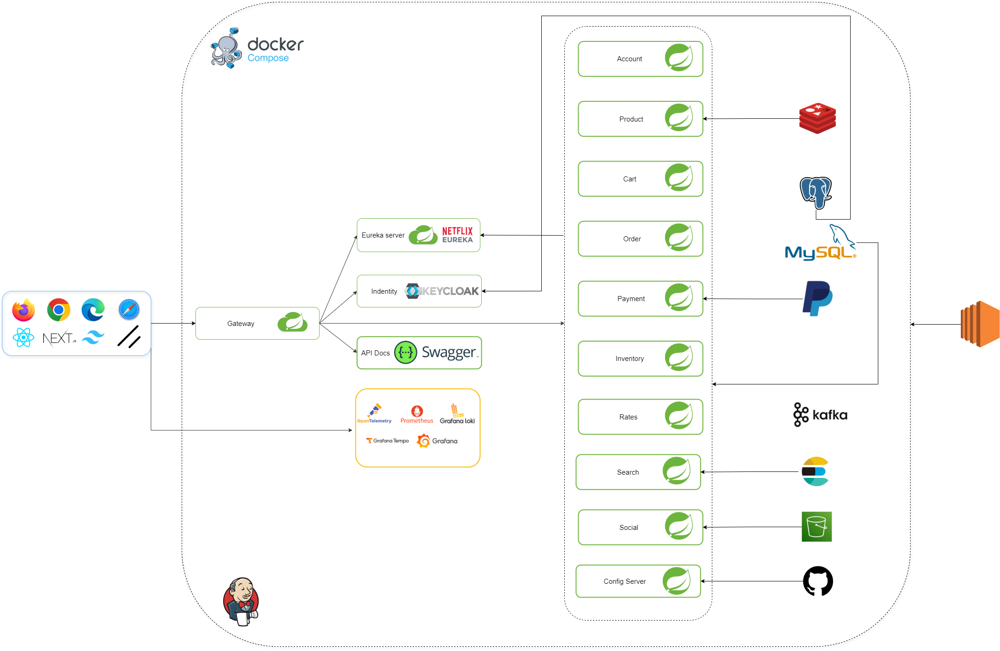
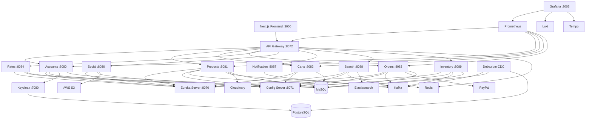
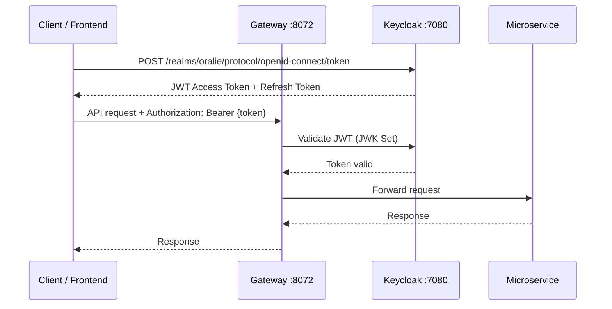

# Oralie - E-commerce Microservices Platform

[](https://jenkins.io/)
[](https://sonarcloud.io/)
[](https://github.com/vietviet08/Oralie/releases)
[](LICENSE)
[](https://www.oracle.com/java/)
[](https://spring.io/projects/spring-boot)
[](https://spring.io/projects/spring-cloud)

> A modern, scalable e-commerce platform built with microservices architecture, featuring comprehensive product management, shopping cart, order processing, payment integration, and advanced DevOps monitoring capabilities.

---

## Table of Contents

- [Description](#description)
- [Features](#features)
- [Architecture](#architecture)
- [Tech Stack](#tech-stack)
- [Screenshots](#screenshots)
- [Installation \& Setup](#installation--setup)
- [Service Ports](#service-ports)
- [Usage](#usage)
- [Configuration](#configuration)
- [Project Structure](#project-structure)
- [API Documentation](#api-documentation)
- [Testing](#testing)
- [Deployment](#deployment)
- [Contributing](#contributing)
- [License](#license)
- [Authors \& Maintainers](#authors--maintainers)
- [Acknowledgments](#acknowledgments)

---

## Description

Oralie is a comprehensive e-commerce platform designed with modern microservices architecture. The platform provides a complete online shopping experience with features including product catalog management, shopping cart functionality, order processing, payment integration (PayPal), user authentication (Keycloak), real-time notifications, full-text search (Elasticsearch), and a Next.js storefront.

Built with **Spring Boot 3.3** and **Spring Cloud 2023.0.3**, Oralie emphasizes scalability, maintainability, and observability through distributed tracing (OpenTelemetry + Tempo), centralized logging (Loki + Grafana Alloy), and metrics collection (Prometheus + Grafana).

**Key Objectives:**

- Provide a scalable and maintainable e-commerce solution
- Demonstrate microservices best practices with Spring Cloud ecosystem
- Integrate modern DevOps and full-stack observability tooling
- Support event-driven architecture with Apache Kafka & Debezium CDC
- Enable easy deployment with Docker Compose

---

## Features

### Core E-commerce

- **Product Management** — Complete product catalog with categories, pricing, inventory, image upload (Cloudinary), and Excel import/export
- **Shopping Cart** — Add, remove, and manage items with real-time updates
- **Order Processing** — End-to-end order management from creation to fulfillment
- **Payment Integration** — PayPal payment processing and transaction management
- **User Authentication** — OAuth2/OIDC with Keycloak, JWT-based security
- **Full-Text Search** — Elasticsearch-powered product search with Kafka-synced indexing
- **Ratings & Reviews** — Product rating and review system
- **Media Storage** — AWS S3 integration for user-uploaded media
- **Notifications** — Kafka-driven email notifications with Thymeleaf templates

### Technical Highlights

- **Microservices Architecture** — 12 independently deployable services
- **Service Discovery** — Netflix Eureka for automatic registration and discovery
- **API Gateway** — Spring Cloud Gateway with rate limiting (Redis-backed) and centralized routing
- **Centralized Configuration** — Spring Cloud Config Server with Git-backed configs
- **Circuit Breaker** — Resilience4j for fault tolerance
- **Inter-service Communication** — OpenFeign declarative REST clients
- **Event-Driven Architecture** — Apache Kafka for asynchronous messaging; Debezium for Change Data Capture (CDC)
- **Caching** — Redis for product data and gateway rate limiting
- **API Docs** — SpringDoc OpenAPI (Swagger UI) per service

### Monitoring & Observability

- **Metrics** — Prometheus + Micrometer for metrics collection
- **Dashboards** — Grafana for visualization
- **Distributed Tracing** — OpenTelemetry Java Agent → Grafana Tempo
- **Centralized Logging** — Grafana Alloy → Loki (read/write/backend mode)
- **Health Checks** — Spring Boot Actuator readiness/liveness probes
- **Code Quality** — SonarQube for static analysis

### Planned Features

- Recommendation engine (AI-powered)
- Live chat support
- Native mobile applications
- Multi-tenant / multi-vendor support
- Advanced analytics & reporting

---

## Architecture



The platform follows a microservices architecture pattern:


```mermaid
graph TD
    FE[Next.js Frontend :3000] --> GW[API Gateway :8072]

    GW --> ACC[Accounts :8080]
    GW --> PRD[Products :8081]
    GW --> CRT[Carts :8082]
    GW --> ORD[Orders :8083]
    GW --> RAT[Rates :8084]
    GW --> SOC[Social :8086]
    GW --> NOT[Notification :8087]
    GW --> SRC[Search :8088]
    GW --> INV[Inventory :8089]

    ACC --> EUR[Eureka Server :8070]
    PRD --> EUR
    CRT --> EUR
    ORD --> EUR
    RAT --> EUR
    SOC --> EUR
    SRC --> EUR
    INV --> EUR

    ACC --> CFG[Config Server :8071]
    PRD --> CFG
    CRT --> CFG
    ORD --> CFG
    RAT --> CFG
    SOC --> CFG
    SRC --> CFG
    INV --> CFG

    ACC --> KC[Keycloak :7080]

    PRD --> KFK[Kafka]
    ORD --> KFK
    NOT --> KFK
    SRC --> KFK
    INV --> KFK

    PRD --> RDS[Redis]
    GW --> RDS

    SRC --> ES[Elasticsearch]

    PRD --> CLD[Cloudinary]
    SOC --> S3[AWS S3]
    ORD --> PP[PayPal]

    DBZ[Debezium CDC] --> KFK
    DBZ --> DB[(MySQL)]
    DBZ --> PG[(PostgreSQL)]

    ACC --> DB
    PRD --> DB
    CRT --> DB
    ORD --> DB
    RAT --> DB
    INV --> DB

    KC --> PG

    PROM[Prometheus] --> GW
    PROM --> ACC
    PROM --> PRD
    PROM --> CRT
    PROM --> ORD

    GRF[Grafana :3003] --> PROM
    GRF --> LOKI[Loki]
    GRF --> TEMPO[Tempo]
```

---

## Tech Stack

| Category            | Technology               | Version        |
| ------------------- | ------------------------ | -------------- |
| **Language**        | Java                     | 17             |
| **Framework**       | Spring Boot              | 3.3.3 – 3.4.1  |
| **Cloud**           | Spring Cloud             | 2023.0.3       |
| **Auth**            | Keycloak                 | 26.0.6         |
| **Database**        | MySQL                    | 8.x            |
| **Database**        | PostgreSQL               | 16.4           |
| **Cache**           | Redis                    | latest         |
| **Search**          | Elasticsearch            | 8.15.3         |
| **Messaging**       | Apache Kafka (Confluent) | 7.5.0          |
| **CDC**             | Debezium                 | 2.5 / 2.7.3    |
| **Gateway**         | Spring Cloud Gateway     | —              |
| **Discovery**       | Netflix Eureka           | —              |
| **Resilience**      | Resilience4j             | —              |
| **Tracing**         | OpenTelemetry Java Agent | 1.33.5         |
| **Metrics**         | Prometheus + Micrometer  | latest         |
| **Dashboards**      | Grafana                  | latest         |
| **Logging**         | Loki + Grafana Alloy     | 3.1.0          |
| **Tracing Backend** | Grafana Tempo            | latest         |
| **Code Quality**    | SonarQube                | 10.4 Community |
| **Payment**         | PayPal REST SDK          | 1.14.0         |
| **Image Upload**    | Cloudinary               | 1.33.0         |
| **Storage**         | AWS S3                   | —              |
| **Frontend**        | Next.js                  | —              |
| **Build**           | Maven + Jib              | 3.4.1          |
| **CI/CD**           | Jenkins                  | —              |
| **Container**       | Docker + Docker Compose  | 3.9            |

---

## Screenshots

### Infrastructure & Monitoring

<table>
  <tr>
    <td align="center">
      
      <br><strong>Docker Containers</strong>
    </td>
    <td align="center">
      
      <br><strong>Service Discovery (Eureka)</strong>
    </td>
  </tr>
  <tr>
    <td align="center">
      
      <br><strong>Metrics (Prometheus)</strong>
    </td>
    <td align="center">
      
      <br><strong>Monitoring (Grafana)</strong>
    </td>
  </tr>
  <tr>
    <td align="center">
      
      <br><strong>Authentication (Keycloak)</strong>
    </td>
    <td align="center">
      
      <br><strong>Distributed Logging (Loki)</strong>
    </td>
  </tr>
</table>

### User Interface

<table>
  <tr>
    <td align="center">
      
      <br><strong>Home Page</strong>
    </td>
    <td align="center">
      
      <br><strong>User Login</strong>
    </td>
  </tr>
  <tr>
    <td align="center">
      
      <br><strong>Product Catalog</strong>
    </td>
    <td align="center">
      
      <br><strong>Product Details</strong>
    </td>
  </tr>
  <tr>
    <td align="center">
      
      <br><strong>Shopping Cart</strong>
    </td>
    <td align="center">
      
      <br><strong>Checkout Process</strong>
    </td>
  </tr>
</table>

### Admin Interface

<table>
  <tr>
    <td align="center">
      
      <br><strong>Admin Dashboard</strong>
    </td>
    <td align="center">
      
      <br><strong>Product Management</strong>
    </td>
  </tr>
  <tr>
    <td align="center">
      
      <br><strong>Add New Product</strong>
    </td>
    <td align="center"></td>
  </tr>
</table>

---

## Installation & Setup

### Prerequisites

| Tool           | Version | Purpose                       |
| -------------- | ------- | ----------------------------- |
| Java JDK       | 17+     | Runtime environment           |
| Maven          | 3.8+    | Build automation              |
| Docker         | 20.10+  | Containerization              |
| Docker Compose | 2.0+    | Multi-container orchestration |
| Git            | 2.30+   | Version control               |

### Quick Start

1. **Clone the repository**

   ```bash
   git clone https://github.com/vietviet08/Oralie.git
   cd Oralie
   ```

2. **Build all microservices**

   ```bash
   # Build each service (no parent POM aggregator)
   for svc in library configserver eurekaserver gatewayserver accounts products carts orders payment rates inventory notification search social; do
     cd $svc && ../mvnw clean install -DskipTests && cd ..
   done
   ```

   Or build individually:

   ```bash
   cd accounts && ./mvnw clean package -DskipTests
   ```

3. **Configure environment**

   Create a `.env` file in `docker/default/` with the required variables (see [Configuration](#configuration)).

4. **Run with Docker Compose (Recommended)**

   ```bash
   cd docker/default
   docker-compose up -d

   # Check service status
   docker-compose ps

   # View logs for a specific service
   docker-compose logs -f accounts
   ```

5. **Run locally (Development)**

   ```bash
   # Start infrastructure first via Docker
   cd docker/default
   docker-compose up -d postgres oralie_db redis kafka zookeeper elasticsearch keycloak

   # Then start Spring services locally
   cd ../../configserver && ./mvnw spring-boot:run &
   cd ../eurekaserver && ./mvnw spring-boot:run &
   cd ../gatewayserver && ./mvnw spring-boot:run &
   cd ../accounts && ./mvnw spring-boot:run &
   # ... start other services as needed
   ```

### Verification

After setup, verify the installation:

| Component        | URL                                   |
| ---------------- | ------------------------------------- |
| Eureka Dashboard | http://localhost:8070                 |
| Config Server    | http://localhost:8071/actuator/health |
| API Gateway      | http://localhost:8072                 |
| Keycloak Admin   | http://localhost:7080                 |
| Grafana          | http://localhost:3003                 |
| Prometheus       | http://localhost:9090                 |
| Kafka UI         | http://localhost:8989                 |
| SonarQube        | http://localhost:9000                 |
| Elasticsearch    | http://localhost:9200                 |
| PgAdmin          | http://localhost:5050                 |

---

## Service Ports

### Infrastructure Services

| Service        | Port | Description                  |
| -------------- | ---- | ---------------------------- |
| Config Server  | 8071 | Centralized configuration    |
| Eureka Server  | 8070 | Service discovery            |
| Gateway Server | 8072 | API gateway & routing        |
| Keycloak       | 7080 | Identity & access management |

### Business Services

| Service      | Port | Description                        |
| ------------ | ---- | ---------------------------------- |
| Accounts     | 8080 | User account management            |
| Products     | 8081 | Product catalog & categories       |
| Carts        | 8082 | Shopping cart management           |
| Orders       | 8083 | Order processing & PayPal payment  |
| Rates        | 8084 | Ratings & reviews                  |
| Social       | 8086 | Media & AWS S3 storage             |
| Notification | 8087 | Email notifications (Kafka-driven) |
| Search       | 8088 | Elasticsearch full-text search     |
| Inventory    | 8089 | Inventory management               |

### Data & Messaging

| Service       | Port | Description                      |
| ------------- | ---- | -------------------------------- |
| MySQL         | 3306 | Primary database (microservices) |
| PostgreSQL    | 5432 | Keycloak & SonarQube database    |
| Redis         | 6379 | Caching & rate limiting          |
| Elasticsearch | 9200 | Search engine                    |
| Kafka         | 9092 | Message broker                   |
| Zookeeper     | 2181 | Kafka coordination               |
| Debezium      | 9083 | Change Data Capture              |

### Monitoring & Tools

| Service       | Port        | Description                |
| ------------- | ----------- | -------------------------- |
| Prometheus    | 9090        | Metrics collection         |
| Grafana       | 3003        | Dashboards & visualization |
| Tempo         | 3110 / 4317 | Distributed tracing        |
| Loki Gateway  | 3100        | Log aggregation            |
| Grafana Alloy | 12345       | Log/metrics collector      |
| Kafka UI      | 8989        | Kafka management UI        |
| SonarQube     | 9000        | Code quality analysis      |
| PgAdmin       | 5050        | PostgreSQL admin           |

### Frontend

| Service          | Port | Description                |
| ---------------- | ---- | -------------------------- |
| Next.js Frontend | 3000 | Customer-facing storefront |

---

## Usage

### API Examples

All API requests go through the **Gateway Server** at `http://localhost:8072`.

#### Authentication (Keycloak)

```bash
# Get access token from Keycloak
curl -X POST http://localhost:7080/realms/oralie/protocol/openid-connect/token \
  -H "Content-Type: application/x-www-form-urlencoded" \
  -d "grant_type=password&client_id=YOUR_CLIENT_ID&client_secret=YOUR_CLIENT_SECRET&username=user@example.com&password=password"
```

#### Products

```bash
# Get all products
curl http://localhost:8072/api/products

# Search products
curl "http://localhost:8072/api/search?q=laptop"
```

#### Shopping Cart

```bash
# Add item to cart
curl -X POST http://localhost:8072/api/carts/items \
  -H "Content-Type: application/json" \
  -H "Authorization: Bearer YOUR_TOKEN" \
  -d '{"productId": 1, "quantity": 2}'

# Get cart
curl http://localhost:8072/api/carts \
  -H "Authorization: Bearer YOUR_TOKEN"
```

#### Orders

```bash
# Create order
curl -X POST http://localhost:8072/api/orders \
  -H "Content-Type: application/json" \
  -H "Authorization: Bearer YOUR_TOKEN" \
  -d '{
    "shippingAddress": {
      "street": "123 Main St",
      "city": "Ho Chi Minh",
      "zipCode": "70000",
      "country": "VN"
    },
    "paymentMethod": "PAYPAL"
  }'
```

---

## Configuration

### Environment Variables

Create a `.env` file in `docker/default/` with:

```env
# Docker image version
LATEST_VERSION=1.0.4

# PostgreSQL (Keycloak & SonarQube)
POSTGRES_USER=keycloak
POSTGRES_PASSWORD=your_password

# PgAdmin
PGADMIN_DEFAULT_EMAIL=admin@oralie.com
PGADMIN_DEFAULT_PASSWORD=admin

# MySQL (Microservices)
MYSQL_ROOT_PASSWORD=your_mysql_root_password

# Keycloak
KEYCLOAK_ADMIN=admin
KEYCLOAK_ADMIN_PASSWORD=admin
KEYCLOAK_URL=http://keycloak:7080
KEYCLOAK_CLIENT_ID=your_client_id
KEYCLOAK_CLIENT_SECRET=your_client_secret
KEYCLOAK_STORE_CLIENT_ID=your_store_client_id
KEYCLOAK_STORE_CLIENT_SECRET=your_store_client_secret

# PayPal
PAYPAL_CLIENT_ID=your_paypal_client_id
PAYPAL_CLIENT_SECRET=your_paypal_client_secret

# AWS S3 (Social service)
AWS_REGION=ap-southeast-1
AWS_BUCKET_NAME=your_bucket
AWS_ACCESS_KEY=your_access_key
AWS_SECRET_KEY=your_secret_key
URL_AWS_S3=https://your-bucket.s3.amazonaws.com

# Mail (Notification service)
MAIL_HOST=smtp.gmail.com
MAIL_PORT=587
USERNAME_MAIL=your_email@gmail.com
PASSWORD_MAIL=your_app_password

# Frontend
NEXTAUTH_SECRET=your_nextauth_secret
NEXTAUTH_URL=http://localhost:3000
NEXT_DEBUG_HYDRATION=false
GOOGLE_CLIENT_ID=your_google_client_id
GOOGLE_CLIENT_SECRET=your_google_client_secret
URL_TT=your_url
URL_PICTURE=your_url
```

### Service Configuration

Each microservice loads its configuration from the **Config Server** (port 8071), which sources configs from a Git repository. Service-specific overrides can be set via environment variables in `docker-compose.yml`.

Common configuration pattern per service:

```yaml
spring:
  application:
    name: products
  config:
    import: "optional:configserver:http://localhost:8071/"

eureka:
  client:
    service-url:
      defaultZone: http://localhost:8070/eureka/

management:
  endpoints:
    web:
      exposure:
        include: health,info,metrics,prometheus
  endpoint:
    health:
      show-details: always
```

---

## Project Structure

```
Oralie/
├── accounts/              # User account management service (port 8080)
├── products/              # Product catalog service (port 8081)
├── carts/                 # Shopping cart service (port 8082)
├── orders/                # Order processing + PayPal (port 8083)
├── rates/                 # Ratings & reviews service (port 8084)
├── social/                # Media & AWS S3 service (port 8086)
├── notification/          # Kafka-driven email service (port 8087)
├── search/                # Elasticsearch search service (port 8088)
├── inventory/             # Inventory management service (port 8089)
├── payment/               # Payment processing service
├── configserver/          # Spring Cloud Config Server (port 8071)
├── eurekaserver/          # Netflix Eureka Server (port 8070)
├── gatewayserver/         # Spring Cloud Gateway (port 8072)
├── library/               # Shared library module (DTOs, utilities)
├── keycloak/
│   ├── realm-export.json  # Keycloak realm configuration
│   ├── kel-kafka/         # Keycloak Kafka event listener SPI
│   └── themes/oralie/     # Custom Keycloak UI theme
├── docker/
│   ├── default/           # Default Docker Compose environment
│   │   ├── docker-compose.yml
│   │   ├── common-config.yml
│   │   ├── configs/       # Debezium connector configs
│   │   ├── mysql/         # MySQL init scripts
│   │   ├── postgres/      # PostgreSQL init scripts
│   │   └── sonarqube/     # SonarQube configuration
│   ├── prod/              # Production environment
│   ├── libs/              # Shared JARs / providers
│   └── observability/     # Monitoring stack configs
│       ├── alloy/         # Grafana Alloy config
│       ├── grafana/       # Grafana datasources
│       ├── loki/          # Loki config
│       ├── prometheus/    # Prometheus scrape config
│       └── tempo/         # Tempo config
├── assets/                # Documentation images
├── Jenkinsfile            # Jenkins CI/CD pipeline
└── README.md
```

---

## API Documentation

### Swagger UI

Each service exposes OpenAPI docs via SpringDoc:

| Service              | Swagger URL                           |
| -------------------- | ------------------------------------- |
| Accounts             | http://localhost:8080/swagger-ui.html |
| Products             | http://localhost:8081/swagger-ui.html |
| Carts                | http://localhost:8082/swagger-ui.html |
| Orders               | http://localhost:8083/swagger-ui.html |
| Rates                | http://localhost:8084/swagger-ui.html |
| Social               | http://localhost:8086/swagger-ui.html |
| Search               | http://localhost:8088/swagger-ui.html |
| Inventory            | http://localhost:8089/swagger-ui.html |
| Gateway (aggregated) | http://localhost:8072/swagger-ui.html |

### Authentication Flow


```mermaid
sequenceDiagram
    participant C as Client / Frontend
    participant GW as Gateway :8072
    participant KC as Keycloak :7080
    participant S as Microservice

    C->>KC: POST /realms/oralie/protocol/openid-connect/token
    KC-->>C: JWT Access Token + Refresh Token

    C->>GW: API request + Authorization: Bearer {token}
    GW->>KC: Validate JWT (JWK Set)
    KC-->>GW: Token valid
    GW->>S: Forward request
    S-->>GW: Response
    GW-->>C: Response
```

---

## Testing

### Running Tests

```bash
# Run tests for a specific service
cd accounts && ./mvnw test

# Run tests with coverage report
cd accounts && ./mvnw test jacoco:report
# Open target/site/jacoco/index.html

# Run integration tests
cd accounts && ./mvnw verify -P integration-test
```

### Test Frameworks

| Framework            | Purpose                |
| -------------------- | ---------------------- |
| JUnit 5              | Unit testing           |
| Mockito              | Mocking                |
| Spring Boot Test     | Integration testing    |
| Spring Security Test | Security layer testing |

---

## Deployment

### Docker Compose (Default)

```bash
cd docker/default

# Start all services
docker-compose up -d

# Scale a specific service
docker-compose up -d --scale products=3

# Update a single service
docker-compose up -d --no-deps products

# Stop all
docker-compose down
```

### Production Environment

```bash
cd docker/prod
docker-compose up -d
```

### CI/CD — Jenkins

The project uses a Jenkins pipeline defined in `Jenkinsfile`. The pipeline:

1. Builds Docker images for each microservice
2. Tags images with version numbers (e.g., `vietquoc2408/accounts-oralie:1.0.4`)
3. Pushes images to Docker Hub
4. Can be extended for staging/production deployment

```groovy
// Key environment variables in Jenkinsfile
DOCKERHUB_REPO = 'vietquoc2408'
LATEST_VERSION = '1.0.3'
NEXT_VERSION = '1.0.4'
```

### Health Checks

```bash
# Check any service health
curl http://localhost:8080/actuator/health/readiness

# Prometheus metrics
curl http://localhost:8081/actuator/prometheus

# Service info
curl http://localhost:8072/actuator/info
```

---

## Contributing

### Getting Started

1. **Fork & clone**

   ```bash
   git clone https://github.com/YOUR_USERNAME/Oralie.git
   cd Oralie
   git remote add upstream https://github.com/vietviet08/Oralie.git
   ```

2. **Create a feature branch**

   ```bash
   git checkout -b feature/your-feature-name
   ```

3. **Develop & test**

   ```bash
   cd <service> && ./mvnw clean test
   ```

4. **Commit using Conventional Commits**

   ```
   feat(products): add product search with Elasticsearch
   fix(cart): resolve cart item duplication issue
   docs(readme): update service port table
   ```

5. **Open a Pull Request** against `master`

### Code Style

- **Google Java Style Guide** (4-space indent, 120-char line limit)
- Use Lombok annotations where applicable
- All REST endpoints documented with SpringDoc `@Operation` annotations

### Requirements for PRs

- All existing tests must pass
- New features must include unit tests
- API changes must update Swagger annotations
- At least 1 maintainer approval required

---

## License

This project is licensed under the **MIT License** — see the [LICENSE](LICENSE) file for details.

```
MIT License

Copyright (c) 2024 Oralie Team

Permission is hereby granted, free of charge, to any person obtaining a copy
of this software and associated documentation files (the "Software"), to deal
in the Software without restriction, including without limitation the rights
to use, copy, modify, merge, publish, distribute, sublicense, and/or sell
copies of the Software, and to permit persons to whom the Software is
furnished to do so, subject to the following conditions:

The above copyright notice and this permission notice shall be included in all
copies or substantial portions of the Software.

THE SOFTWARE IS PROVIDED "AS IS", WITHOUT WARRANTY OF ANY KIND, EXPRESS OR
IMPLIED, INCLUDING BUT NOT LIMITED TO THE WARRANTIES OF MERCHANTABILITY,
FITNESS FOR A PARTICULAR PURPOSE AND NONINFRINGEMENT. IN NO EVENT SHALL THE
AUTHORS OR COPYRIGHT HOLDERS BE LIABLE FOR ANY CLAIM, DAMAGES OR OTHER
LIABILITY, WHETHER IN AN ACTION OF CONTRACT, TORT OR OTHERWISE, ARISING FROM,
OUT OF OR IN CONNECTION WITH THE SOFTWARE OR THE USE OR OTHER DEALINGS IN THE
SOFTWARE.
```

---

## Authors & Maintainers

<table>
  <tr>
    <td align="center">
      <a href="https://github.com/vietviet08">
        <br />
        <sub><b>Nguyen Quoc Viet</b></sub>
      </a><br />
      <sub>Project Lead & Backend Developer</sub><br />
      📧 viezquoc.dev@gmail.com
    </td>
  </tr>
</table>

---

## Acknowledgments

### Core Technologies

- **[Spring Boot](https://spring.io/projects/spring-boot)** & **[Spring Cloud](https://spring.io/projects/spring-cloud)** — Application framework & microservices toolkit
- **[Keycloak](https://www.keycloak.org/)** — Identity and access management
- **[Apache Kafka](https://kafka.apache.org/)** — Event streaming platform
- **[Elasticsearch](https://www.elastic.co/)** — Full-text search engine
- **[Debezium](https://debezium.io/)** — Change Data Capture

### Observability

- **[Prometheus](https://prometheus.io/)** — Metrics collection
- **[Grafana](https://grafana.com/)** — Dashboards & visualization
- **[Loki](https://grafana.com/oss/loki/)** — Log aggregation
- **[Tempo](https://grafana.com/oss/tempo/)** — Distributed tracing
- **[OpenTelemetry](https://opentelemetry.io/)** — Observability framework

### Database & Caching

- **[MySQL](https://www.mysql.com/)** — Relational database
- **[PostgreSQL](https://www.postgresql.org/)** — Relational database
- **[Redis](https://redis.io/)** — In-memory caching

### DevOps & Infrastructure

- **[Docker](https://www.docker.com/)** — Containerization
- **[Jenkins](https://www.jenkins.io/)** — CI/CD automation
- **[SonarQube](https://www.sonarqube.org/)** — Code quality analysis

### Learning Resources

- _Microservices Patterns_ — Chris Richardson
- _Spring Boot in Action_ — Craig Walls
- _Building Microservices_ — Sam Newman
- [Baeldung](https://www.baeldung.com/) — Java & Spring tutorials
- [Spring Guides](https://spring.io/guides) — Official Spring guides

---

<div align="center">
  <h3>⭐ If you find this project helpful, please give it a star! ⭐</h3>
  <p>
    <a href="https://github.com/vietviet08/Oralie/stargazers">
      
    </a>
  </p>

  <p>Made with ❤️ by the Oralie Team</p>
  <p>© 2024 Oralie. All rights reserved.</p>
</div>
