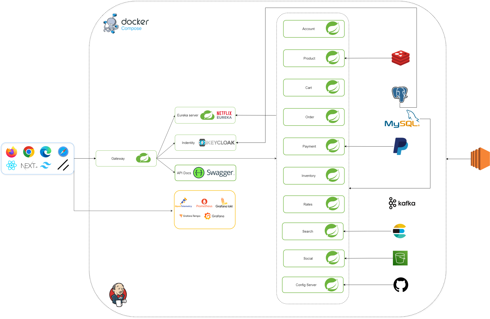

# Oralie - Online Shopping Application

This project is a microservice-based application for online shopping.

## Features

*   Browse products
*   Add products to cart
*   Checkout
*   Manage user accounts

## Screenshots

**Architecture system**

**Docker container**

.png)
**Prometheus**

.png)
**Keycloak**

.png)
**Eureka server**

.png)
**Grafana**

.png)
**Loki trace**

.png)
**Admin dashboard**

.png)
**Product page**

.png)
**Add product**

.png)
**Login**

.png)
**Home**

.png)
**Products**

.png)
**Product details**

.png)
**Cart**

.png)
**Checkout**

## Installation

1.  Clone the repository.
2.  Install dependencies.
3.  Run the application.

## Usage

1.  Browse to the application URL.
2.  Create an account.
3.  Start shopping.

## Contributing

1.  Fork the repository.
2.  Create a branch.
3.  Submit a pull request.

## License

MIT
