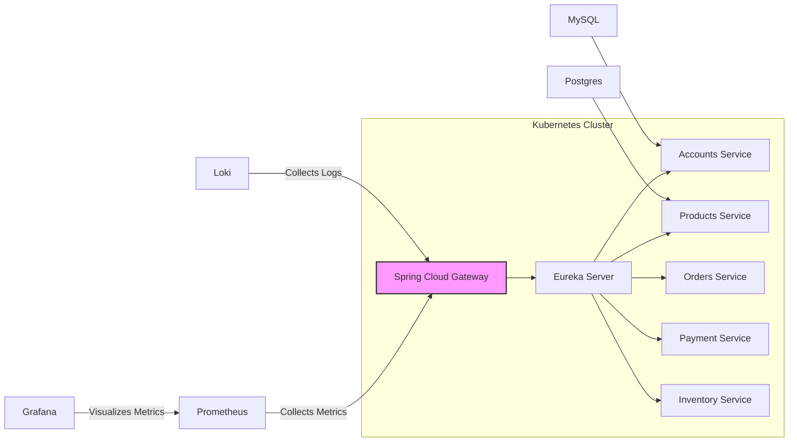
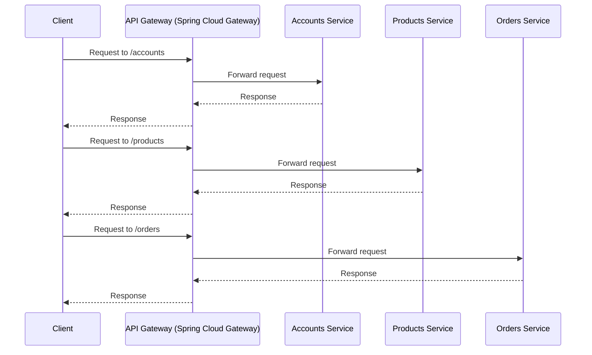

# Architecture Document

## 1. Introduction

This document provides a comprehensive overview of the architecture for the Oralie project, a microservice-based application designed for deployment on Kubernetes. It outlines the key components, their responsibilities, and how they interact to deliver the overall functionality. This document is intended for developers, operations engineers, and other stakeholders involved in the development, deployment, and maintenance of the Oralie project.

## 2. Architecture Overview

The Oralie project follows a microservice architecture, where the application is decomposed into a collection of small, independent, and loosely coupled services. Each microservice is responsible for a specific business function and can be developed, deployed, and scaled independently.

The following diagram illustrates the high-level architecture of the Oralie project:



The technology stack used in the Oralie project includes:

*   **Programming Language:** Java
*   **Framework:** Spring Boot
*   **Service Discovery:** Eureka Server
*   **API Gateway:** Spring Cloud Gateway
*   **Configuration Management:** Spring Cloud Config Server
*   **Data Persistence:** MySQL, Postgres
*   **Monitoring:** Prometheus
*   **Visualization:** Grafana
*   **Logging:** Loki
*   **Containerization:** Docker
*   **Orchestration:** Kubernetes
## 3. Service Details

### Accounts Service

*   **Name:** Accounts Service
*   **Responsibility:** Manages user accounts, authentication, and authorization.
*   **API Endpoints:**
    *   `/accounts`: Create, retrieve, update, and delete user accounts.
    *   `/accounts/{id}`: Retrieve a specific user account by ID.
    *   `/login`: Authenticate users and generate access tokens.
    *   `/logout`: Invalidate access tokens.
    *   `/register`: Register new user accounts.
*   **Data Model:**
    *   `Account`: Represents a user account with attributes such as ID, username, password, email, first name, last name, etc.
*   **Dependencies:**
    *   MySQL database for storing account information.
    *   Eureka Server for service discovery.
    *   Spring Cloud Config Server for configuration management.
    *   Keycloak for Identity and Access Management.
*   **Configuration:**
    *   `spring.application.name`: accounts
    *   `server.port`: 8080
    *   `spring.datasource.url`: jdbc:mysql://oralie\_db:3306/accounts\_db
    *   `eureka.client.serviceUrl.defaultZone`: http://eurekaserver:8070/eureka
*   **Example Code Snippet:**

```java
@RestController
@RequestMapping("/accounts")
public class AccountController {

    @Autowired
    private AccountService accountService;

    @GetMapping
    public List<Account> getAllAccounts() {
        return accountService.getAllAccounts();
    }

    @GetMapping("/{id}")
    public Account getAccountById(@PathVariable Long id) {
        return accountService.getAccountById(id);
    }

    @PostMapping
    public Account createAccount(@RequestBody Account account) {
        return accountService.createAccount(account);
    }

    @PutMapping("/{id}")
    public Account updateAccount(@PathVariable Long id, @RequestBody Account account) {
        return accountService.updateAccount(id, account);
    }

    @DeleteMapping("/{id}")
    public void deleteAccount(@PathVariable Long id) {
        accountService.deleteAccount(id);
    }
}
### Products Service

*   **Name:** Products Service
*   **Responsibility:** Manages product information, including product details, pricing, and availability.
*   **API Endpoints:**
    *   `/products`: Create, retrieve, update, and delete products.
    *   `/products/{id}`: Retrieve a specific product by ID.
    *   `/search`: Search for products based on keywords or categories.
*   **Data Model:**
    *   `Product`: Represents a product with attributes such as ID, name, description, price, image URL, etc.
*   **Dependencies:**
    *   Postgres database for storing product information.
    *   Eureka Server for service discovery.
    *   Spring Cloud Config Server for configuration management.
*   **Configuration:**
    *   `spring.application.name`: products
    *   `server.port`: 8081
    *   `spring.datasource.url`: jdbc:postgresql://products\_db:5432/products\_db
    *   `eureka.client.serviceUrl.defaultZone`: http://eurekaserver:8070/eureka
*   **Example Code Snippet:**

```java
@RestController
@RequestMapping("/products")
public class ProductController {

    @Autowired
    private ProductService productService;

    @GetMapping
    public List<Product> getAllProducts() {
        return productService.getAllProducts();
    }

    @GetMapping("/{id}")
    public Product getProductById(@PathVariable Long id) {
        return productService.getProductById(id);
    }

    @PostMapping
    public Product createProduct(@RequestBody Product product) {
        return productService.createProduct(product);
    }

    @PutMapping("/{id}")
    public Product updateProduct(@PathVariable Long id, @RequestBody Product product) {
        return productService.updateProduct(id, product);
    }

    @DeleteMapping("/{id}")
    public void deleteProduct(@PathVariable Long id) {
        productService.deleteProduct(id);
    }
}

## 4. Inter-service Communication

The Oralie project uses RESTful APIs for inter-service communication. Each microservice exposes a set of REST endpoints that can be accessed by other services. The API Gateway (Spring Cloud Gateway) acts as a single entry point for all external requests and routes them to the appropriate microservice.

The following diagram illustrates the inter-service communication patterns:



The API Gateway (Spring Cloud Gateway) is configured with routes that define how requests are routed to the appropriate microservice. These routes can be configured using predicates and filters. Predicates match requests based on various criteria, such as path, header, or query parameters. Filters modify requests or responses, such as adding headers or transforming the payload.

The following is an example of an API call between the Accounts Service and the Products Service:

```java
@Service
public class AccountService {

    @Autowired
    private RestTemplate restTemplate;

    @Value("${products.service.url}")
    private String productsServiceUrl;

    public List<Product> getProductsForAccount(Long accountId) {
        ResponseEntity<List<Product>> response = restTemplate.exchange(
                productsServiceUrl + "/products?accountId=" + accountId,
                HttpMethod.GET,
                null,
                new ParameterizedTypeReference<List<Product>>() {}
        );
        return response.getBody();
    }
}
## 5. Data Management

The Oralie project uses a combination of MySQL and Postgres databases for data persistence. Each microservice is responsible for managing its own data and has its own database schema.

*   **Accounts Service:** Uses MySQL to store account information.
*   **Products Service:** Uses Postgres to store product information.
*   **Orders Service:** Uses MySQL to store order information.
*   **Payment Service:** Uses Postgres to store payment information.
*   **Inventory Service:** Uses MySQL to store inventory information.

Data consistency is maintained through eventual consistency patterns. Each microservice is responsible for ensuring the consistency of its own data.

The following is an example of a database schema for the Accounts Service:

```sql
CREATE TABLE accounts (
    id BIGINT PRIMARY KEY AUTO_INCREMENT,
    username VARCHAR(255) NOT NULL,
    password VARCHAR(255) NOT NULL,
    email VARCHAR(255) NOT NULL,
    first_name VARCHAR(255) NOT NULL,
    last_name VARCHAR(255) NOT NULL
);
```

The following is an example of a database schema for the Products Service:

```sql
CREATE TABLE products (
    id BIGSERIAL PRIMARY KEY,
    name VARCHAR(255) NOT NULL,
    description TEXT,
    price DECIMAL(10, 2) NOT NULL,
    image_url VARCHAR(255)
);
## 6. Deployment Considerations

The Oralie project is designed for deployment on Kubernetes. Each microservice is packaged as a Docker container and deployed to a Kubernetes cluster.

The following is an example of a Kubernetes deployment manifest for the Accounts Service:

```yaml
apiVersion: apps/v1
kind: Deployment
metadata:
  name: accounts-deployment
spec:
  replicas: 3
  selector:
    matchLabels:
      app: accounts
  template:
    metadata:
      labels:
        app: accounts
    spec:
      containers:
        - name: accounts
          image: vietquoc2408/accounts-oralie:${LATEST_VERSION}
          ports:
            - containerPort: 8080
          env:
            - name: SPRING_APPLICATION_NAME
              value: "accounts"
            - name: SPRING_DATASOURCE_URL
              value: "jdbc:mysql://oralie_db:3306/accounts_db"
            - name: EUREKA_CLIENT_SERVICEURL_DEFAULTZONE
              value: "http://eurekaserver:8070/eureka"
```

The following is an example of a Kubernetes service manifest for the Accounts Service:

```yaml
apiVersion: v1
kind: Service
metadata:
  name: accounts-service
spec:
  selector:
    app: accounts
  ports:
    - protocol: TCP
      port: 8080
      targetPort: 8080
  type: LoadBalancer
```

Service discovery in Kubernetes is handled by Eureka Server. Each microservice registers itself with Eureka Server, which provides a central registry of all available services.

The deployment strategy for the microservices is rolling updates. This allows for zero-downtime deployments and updates.
## 7. Monitoring and Logging

The Oralie project uses Prometheus, Grafana, and Loki for monitoring and logging.

*   **Prometheus:** Collects metrics from the microservices and stores them in a time-series database.
*   **Grafana:** Visualizes the metrics collected by Prometheus and provides dashboards for monitoring the health and performance of the microservices.
*   **Loki:** Collects logs from the microservices and stores them in a centralized location.

The following is an example of a Prometheus configuration file:

```yaml
scrape_configs:
  - job_name: 'accounts'
    metrics_path: '/actuator/prometheus'
    static_configs:
      - targets: ['accounts-service:8080']
  - job_name: 'products'
    metrics_path: '/actuator/prometheus'
    static_configs:
      - targets: ['products-service:8081']
```

The following is an example of a Grafana dashboard:

(Image of Grafana dashboard showing CPU usage, memory usage, and response time for the microservices)

Loki is configured to collect logs from the microservices using Fluentd. Fluentd is a data collector that can collect logs from various sources and forward them to Loki.
## 8. Scaling Strategies

The Oralie project uses horizontal scaling to handle increased traffic and load. Each microservice can be scaled independently based on its resource utilization.

Kubernetes provides auto-scaling capabilities that can automatically scale the number of replicas for each microservice based on CPU usage, memory consumption, or other metrics.

The following is an example of an auto-scaling configuration for the Accounts Service:

```yaml
apiVersion: autoscaling/v2beta2
kind: HorizontalPodAutoscaler
metadata:
  name: accounts-hpa
spec:
  scaleTargetRef:
    apiVersion: apps/v1
    kind: Deployment
    name: accounts-deployment
  minReplicas: 3
  maxReplicas: 10
  metrics:
    - type: Resource
      resource:
        name: cpu
        target:
          type: Utilization
          averageUtilization: 70
```

This configuration will automatically scale the number of replicas for the Accounts Service between 3 and 10 based on CPU utilization. If the average CPU utilization exceeds 70%, Kubernetes will automatically increase the number of replicas. If the average CPU utilization falls below 70%, Kubernetes will automatically decrease the number of replicas.
## 9. CI/CD Pipelines

The Oralie project uses Jenkins for continuous integration and continuous delivery (CI/CD). The CI/CD pipeline automates the process of building, testing, and deploying the microservices.

The CI/CD pipeline consists of the following stages:

*   **Build:** Compiles the source code and creates a Docker image for each microservice.
*   **Test:** Runs automated tests to verify the functionality of the microservices.
*   **Deploy:** Deploys the Docker images to the Kubernetes cluster.

The following is an example of a Jenkinsfile:

```groovy
pipeline {
    agent { dockerfile true }
    stages {
        stage('Build') {
            steps {
                sh 'mvn clean install -DskipTests'
                sh 'docker build -t vietquoc2408/accounts-oralie:${BUILD_NUMBER} .'
            }
        }
        stage('Test') {
            steps {
                sh 'mvn test'
            }
        }
        stage('Deploy') {
            steps {
                sh 'kubectl apply -f kubernetes/deployment.yaml'
                sh 'kubectl apply -f kubernetes/service.yaml'
            }
        }
    }
}
```

This Jenkinsfile defines a simple CI/CD pipeline that builds, tests, and deploys the Accounts Service. The `agent { dockerfile true }` directive tells Jenkins to use a Docker image to run the pipeline. The `stages` directive defines the different stages of the pipeline. The `steps` directive defines the steps to be executed in each stage.
## 10. Future Enhancements

The Oralie project can be further enhanced with the following features:

*   **New Features and Services:**
    *   Implement a recommendation engine to suggest products to users.
    *   Add support for multiple payment methods.
    *   Integrate with social media platforms.
*   **Technology Upgrades and Improvements:**
    *   Upgrade to the latest version of Spring Boot.
    *   Migrate to a more scalable database solution.
    *   Implement a service mesh for improved security and observability.
*   **Performance Enhancements:**
    *   Optimize database queries.
    *   Implement caching to reduce database load.
    *   Use asynchronous communication patterns to improve responsiveness.
*   **Security Enhancements:**
    *   Implement role-based access control.
    *   Add support for multi-factor authentication.
    *   Regularly scan for security vulnerabilities.

## 11. Conclusion

This document provides a comprehensive overview of the architecture for the Oralie project. The project follows a microservice architecture and is designed for deployment on Kubernetes. The key components, their responsibilities, and how they interact to deliver the overall functionality have been outlined. This document serves as a guide for developers, operations engineers, and other stakeholders involved in the development, deployment, and maintenance of the Oralie project.